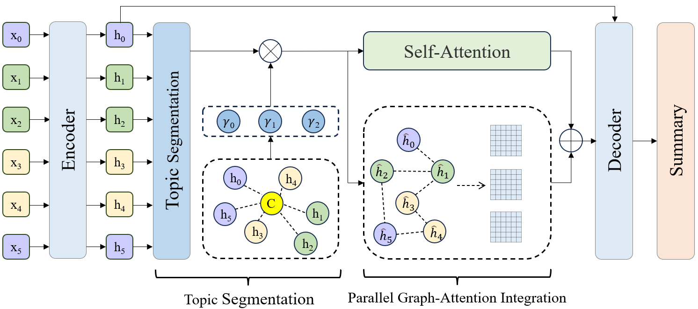

# TAG: Dialogue Summarization Based on Topic Segmentation and Graph Structures


## 📌 Introduction


---

## ⚙️ Setup

Our code is primarily based on 🤗 [Transformers](https://github.com/huggingface/transformers).

### 🧩 Install dependencies

Make sure to install PyTorch corresponding to your CUDA version first, then:

```bash
pip install transformers==4.8.2 \
            py-rouge \
            nltk \
            numpy \
            datasets \
            stanza \
            dgl
